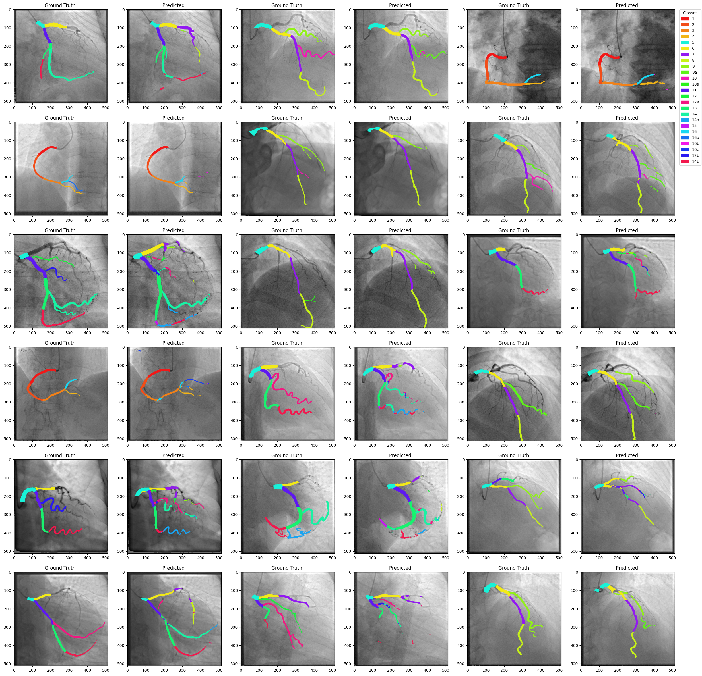

# What Is This Project About 
this is a segementation task done on the syntax portion of the  [arcade dataset](https://www.nature.com/articles/s41597-025-04676-8) . there are 25 classes of heart arteries based on the syntax score , we are trying to segement them ! 
# Models
the model of choice here is a unet-based model resembling the famous nnUunet model but designed to fit our task . attention is also added to the unet since it showed promessing results in this task but can be removed using the hyperparameters in `nnUnetAttention.ipynb` notebook.
# How To Run
this project is still under development so the main file for now is the `nnUnetAttention.ipynb` designed for only training the model.
the log history from the previouse training attempts are available in the `outputs` folder .

